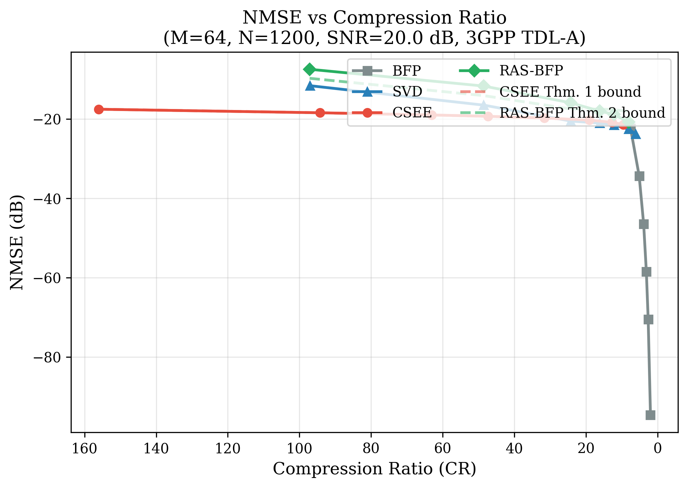
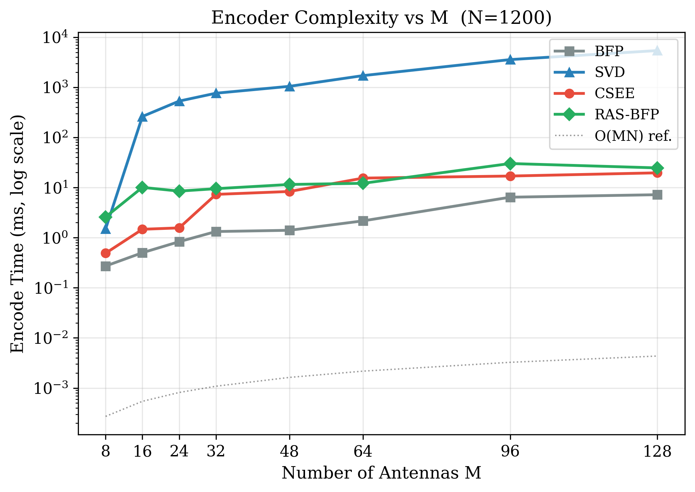
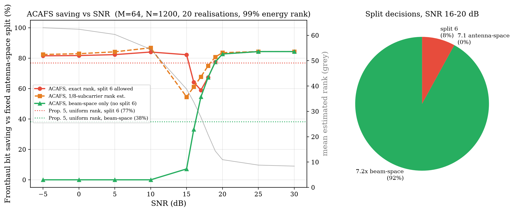
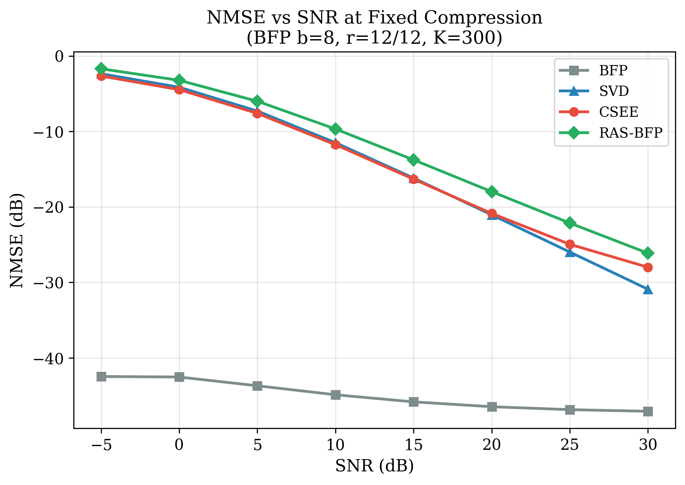

> **SUPERSEDED (2026-09-17).** This deck was written for code that was never committed (`src/` was
> missing) and contains claims that the reconstructed simulator does not support (see `docs/audit.md`:
> inverted split-6 bandwidth model, full-SVD baseline timing, fake fast-rank curve, CSEE evaluated on
> unmodulated symbols, 32-bit CR reference). Use `docs/mid_evaluation.pptx` and `docs/presentation_prep.md`.
> Kept only as a record of the starting point.

# BTP Mid-Term Evaluation — Presentation Deck (15 Slides)

**Title:** High-Performance Fronthaul Load Management in 5G/6G C-RAN  
**Target:** IEEE TWC / JSAC · Mid-Term 50% · September 2026  

> Tip: open `docs/mid_evaluation_slides.html` in a browser for the visual deck.

---

## Slide 1 — Title

### High-Performance Fronthaul Load Management in 5G/6G C-RAN

- **CSEE** — Circulant / delay-domain encoder — $\mathcal{O}(MN\log N)$
- **RAS-BFP** — Rank-adaptive sketched BFP — $\mathcal{O}(rMN)$
- **ACAFS** — Rank-driven functional split (7.2x / 7.1 / 6)
- **Status:** 50% milestone — theory + simulator + benchmarks

---

## Slide 2 — Problem

### Fronthaul Bottleneck in Massive MIMO C-RAN

- RU↔DU I/Q grows as $2\,M\,N\,b\,R_{\mathrm{slot}}$ → **~15.36 Gbps/cell** ($M=64$, 100 MHz)
- O-RAN BFP ≈ **4×** compression only
- Truncated SVD compresses more but costs $\mathcal{O}(MN\min(M,N))$ — too slow for slot budgets

---

## Slide 3 — Architecture

```
 RU:  TDL-A → Y∈C^{M×N}
        ├─ CSEE: IFFT → top-K delay taps → BFP
        └─ RAS-BFP: SRHT → QR → BFP(L,Q)
              │ fronthaul bitstream
 DU:  ACAFS(rank) → Split 7.2x / 7.1 / 6
      Decoder → Ŷ with controlled NMSE
```

---

## Slide 4 — Baselines

**BFP:** shared block exponent + $b$-bit mantissa — fast, limited CR  
**SVD:** $Y\approx U_r\Sigma_r V_r^H$ — optimal rank-$r$ approx, cubic-ish cost

---

## Slide 5 — CSEE + Theorem 1

Delay-domain sparsity of TDL-A:

$$Y_d=\mathrm{IFFT}(Y),\quad S=\mathrm{TopK}(|Y_d|),\quad \hat Y=\mathrm{FFT}(Y_d|_S)$$

$$\mathrm{NMSE}\le \sigma_{\mathrm{tail}}^2/\sigma_Y^2 + (\Delta^2/12)\,K/(MN\sigma_Y^2)$$

Complexity $\mathcal{O}(MN\log N)$ — several× faster than SVD at matched CR.

---

## Slide 6 — RAS-BFP + Theorems 2–4

1. Sketch $Z=\Omega Y$ (SRHT)  
2. $Z^H=QR$  
3. $L=YQ$ → BFP encode $(L,Q)$

$\|Y-LQ^H\|_F^2\le(1+\varepsilon_r)\|Y-Y_r\|_F^2$,  
$r^\star=\sqrt{B_{\mathrm{total}}/(b(M+N))}$

---

## Slide 7 — ACAFS + Theorem 5

| Rank fraction | Split |
|---|---|
| $r/M < 0.15$ | 7.2x |
| $0.15\le r/M < 0.55$ | 7.1 |
| $r/M \ge 0.55$ | 6 |

Expected BW cut vs Split 6 ≈ **33%** (uniform ranks); simulated mean across SNR ≈ **30%+**.

---

## Slide 8 — Setup

| Parameter | Value |
|---|---|
| Channel | 3GPP TR 38.901 TDL-A, 100 ns |
| $M$, $N$ | 64, 1200 |
| SNR | −5 … +30 dB |
| Spatial corr. | Exponential, $\rho=0.7$ |

---

## Slide 9 — Fig 1 · NMSE vs CR



CSEE / RAS-BFP dominate the CR–NMSE frontier vs BFP; bounds overlay Thm 1–2.

---

## Slide 10 — Fig 2 · Complexity



CSEE & RAS-BFP stay far below SVD as $M$ grows.

---

## Slide 11 — Fig 3 · ACAFS Gain



BW reduction vs fixed Split 6 grows as SNR rises and estimated rank collapses.

---

## Slide 12 — Fig 4 · SNR Sweep



Proposed encoders remain stable across the full SNR sweep.

---

## Slide 13 — Comparison Matrix

| Metric | BFP | SVD | CSEE | RAS-BFP |
|---|---|---|---|---|
| CR (op. point) | ~3.9× | ~16× | **~12.7×** ($K=300$) / **~63×** ($K=60$) | ~16× |
| NMSE @ 20 dB | ~−46 dB | ~−21 dB | ~−21 / −19 dB | ~−18 dB |
| Complexity | $O(MN)$ | $O(MN\min(M,N))$ | $O(MN\log N)$ | $O(rMN)$ |
| Encode ($M=64$) | ~3 ms | ~20–30 ms | **~5 ms** | **~7 ms** |
| Bound | Empirical | Truncation | Thm 1 | Thm 2–4 |

---

## Slide 14 — 2nd-Half Roadmap

1. C++ / AVX-512 / CUDA (<100 µs)  
2. Near-RT RIC E2 xApp for ACAFS  
3. USRP / OAI over-the-air trial  
4. IEEE TWC / JSAC submission

---

## Slide 15 — Conclusion

- **50% complete:** theory, code, figures, live notebook  
- CSEE & RAS-BFP: high CR + far lower latency than SVD  
- ACAFS: rank-aware split → material fronthaul savings vs Split 6  
- **Thank you — questions?**
